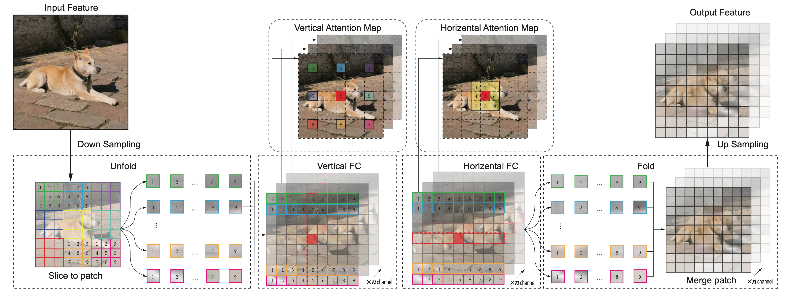
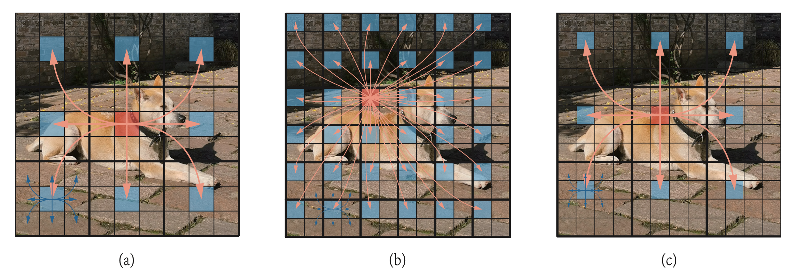

<h2>Lightweight Visual Backbone Network with Enhanced Comprehensive Strength through Context-Aware Dual Attention Mechanism</h2>

Model and code will be available after the paper is accepted.

## Abstract
Recent studies have increasingly concentrated on integrating visual neural networks into edge devices, especially for robots and drones that require effective real-time decision-making and autonomous path planning. Achieving this necessitates lightweight visual networks with robust overall performance. In this study, we adopt a small-scale architecture based on convolutional neural networks (CNNs) and propose a Context-Aware Decoupled Fully Connected (CADFC) attention mechanism to enhance the performance of existing CNN-based visual networks. The core concept of the CADFC attention mechanism is to incorporate both remote and local contexts, enabling the network to capture local features and their relevant remote features. Moreover, we design a novel bottleneck that integrates CADFC attention with depthwise convolution. This design thinking is to accumulate focused regions, learning from depthwise convolution, alongside their surrounding features based on CADFC attention. Experimental results demonstrate that CADFC MobileNet outperforms the recent SOTA network GhostNetV2, achieving a top-1 accuracy of 76.8% with 15% fewer parameters, surpassing GhostNetV2’s 75.3% accuracy by 1.5%. Additionally, it shows an average improvement of 13.85% in AP for object detection and a 4% enhancement in mIoU for semantic segmentation, even in resource- constrained environments.

## Overview

Figure 2: Illustration of the information flow of CADFC attention. The horizontal and vertical fully connected layers are instrumental in modeling the long-range dependencies between patches and the local dependencies within patches, respectively.
 
 

Figure 8: Relationship between kernel size(𝑛×𝑛) for convolutions and patch size(h×𝑤) for folding and unfolding in CADFC. By incorporating both local (blue-colored arrows) and global (orange-colored arrows) information, the red pixel in (a) and (b) can aggregate information from all pixels. In contrast, in (c), the red pixel can only aggregate local information within each patch, resulting in information loss. The grids segmented by bold black lines and thin black lines represent patches and pixels, respectively.

<!-- # Results -->

## Acknowledgment

This project is based on [TIMM](https://github.com/rwightman/pytorch-image-models), GhostNetV2 ([paper](https://arxiv.org/abs/2211.12905), [code](https://github.com/huawei-noah/Efficient-AI-Backbones/tree/master/ghostnetv2_pytorch)), thanks for their excellent works.
